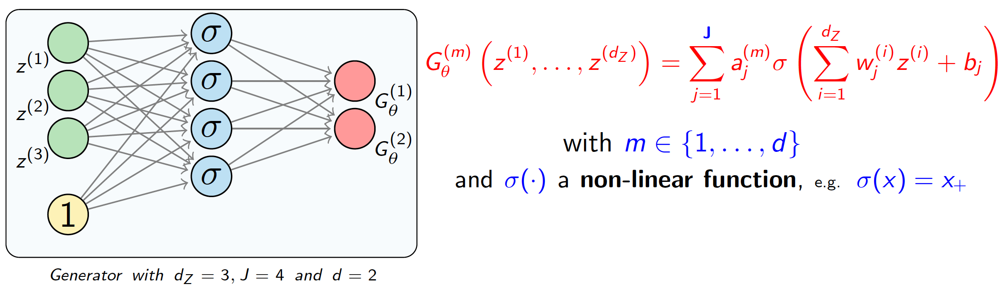
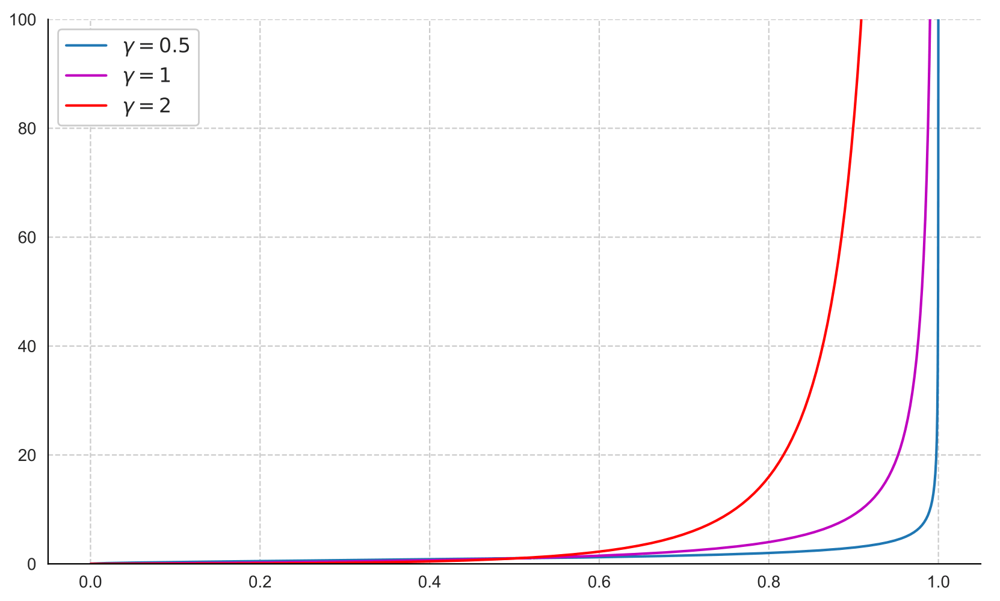
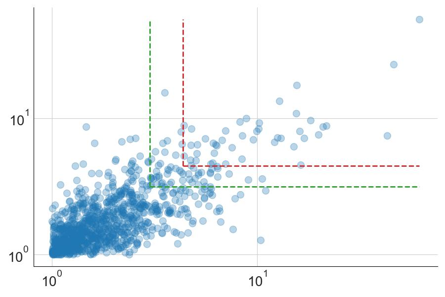
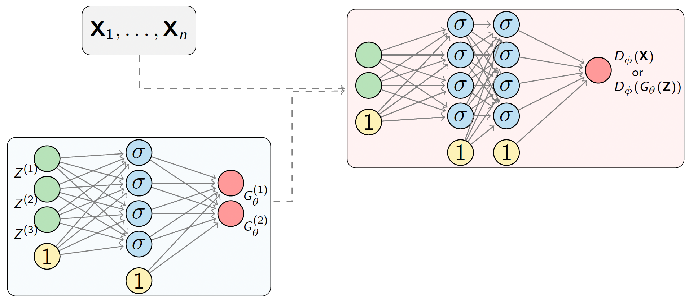
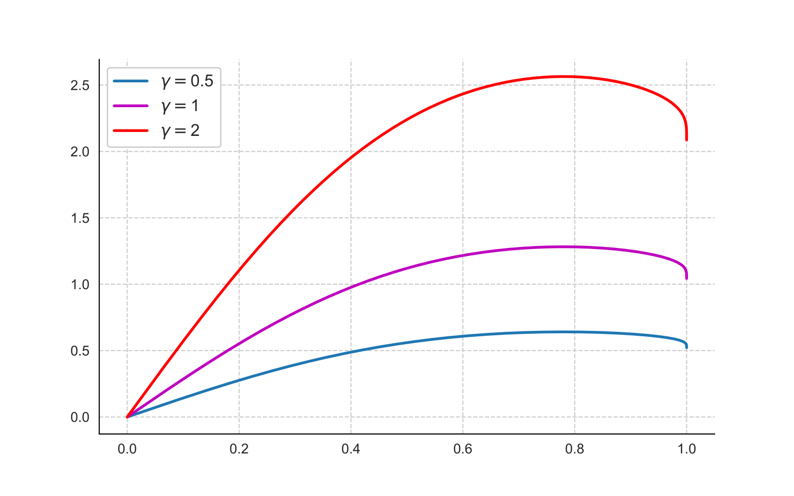
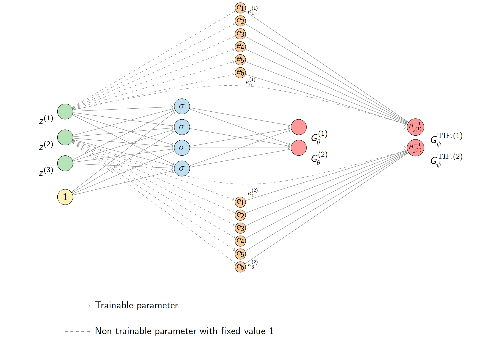
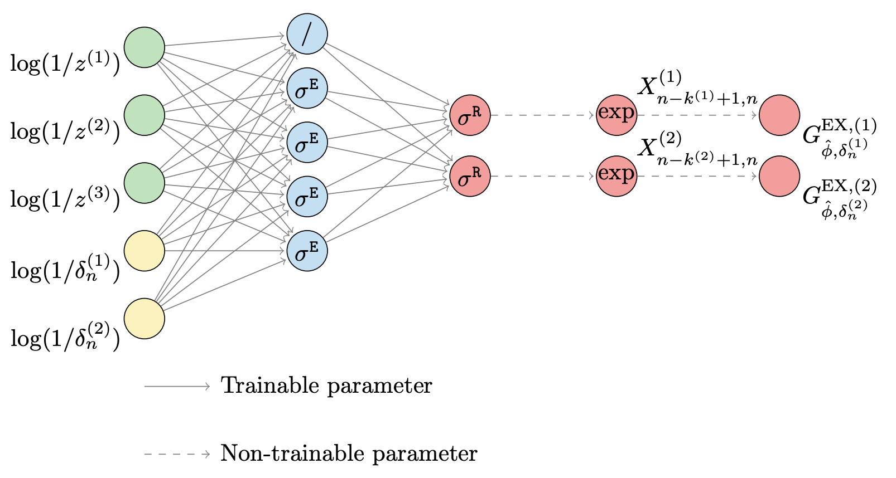
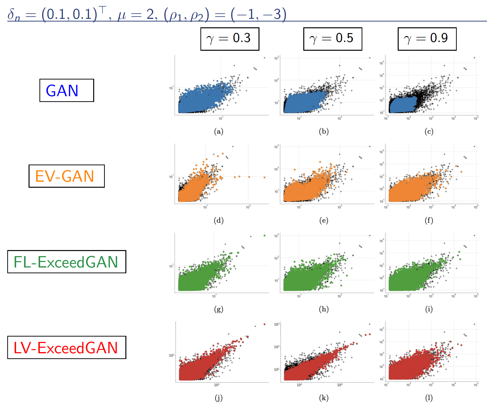
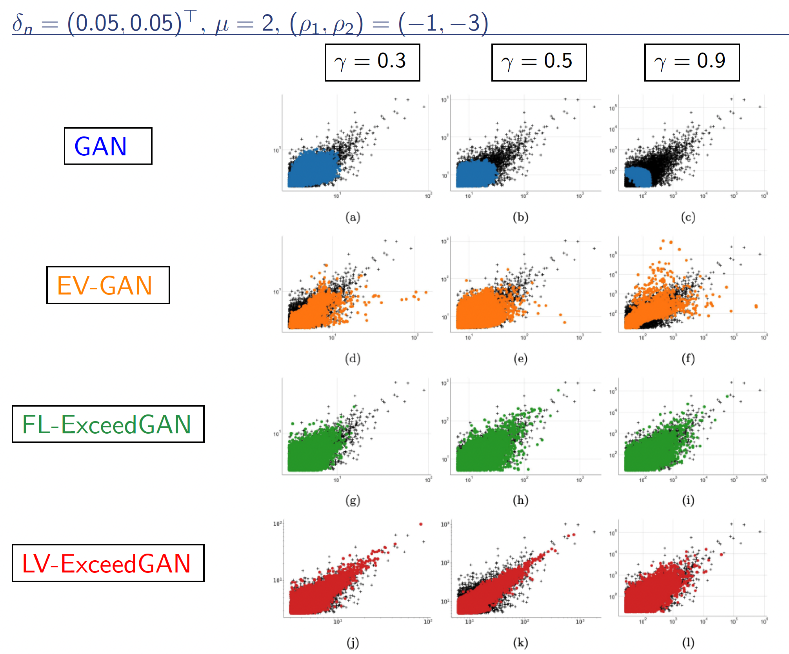

# Simulation of extremes using Generative Adversarial Networks (GANs)

This repository is dedicated to the implementation of two published papers, in joint work
with [Emmanuel Gobet](https://emmanuel-gobet.github.io/index.html) and [Stéphane Girard](https://mistis.inrialpes.fr/people/girard/)
:

- **EV-GAN: Simulation of extreme events
with ReLU neural networks** — [Allouche, Girard & Gobet, JMLR 2022](https://www.jmlr.org/papers/volume23/21-0663/21-0663.pdf)
- **ExceedGAN: Simulation above extreme thresholds using
Generative Adversarial Networks** — [Allouche, Girard & Gobet, Extremes 2026](https://inria.hal.science/hal-05044516v3/document)

Four generative models are implemented:

| Model                   | Key `--model` | Paper |
|-------------------------|---------------|-------|
| Standard GAN (baseline) | `gan` | Goodfellow et al. (2014) |
| EV-GAN                  | `evgan` | EV-GAN, JMLR 2022 |
| Fixed-Level ExceedGAN   | `fl_exceed_gan` | ExceedGAN, Extremes 2026 |
| Level-Varying ExceedGAN | `lv_exceed_gan` | ExceedGAN, Extremes 2026 |

---
## Generative Modeling
If $\mathbf X$ denotes the r.v. taking values in some space $\mathcal X\subseteq\mathbb R^d$ from which we have 
observations $(\mathbf X_1,\dots,\mathbf X_n)$, the problem is to find a function $G:\mathcal Z\to \mathcal X$ and a 
**latent probability distribution** $p_Z$ on $\mathcal Z\subseteq\mathbb R^{d_Z}$ such that
```math
    \mathbf X \overset{\rm d}{=} G(\mathbf Z) \text{ and } \mathbf Z\sim p_Z.
```

> ⚠️ Which class of functions $G$ and densities $p_Z$ may be considered to ensure
> that the equality above holds?

>  **Theorem** (Kuratowski, Villani 2009, page 9).
> Let $(\mathcal{Z}, \mu_Z)$ and $(\mathcal{X}, \mu_X)$ be two Polish probability
> spaces. Then there exists a (non-unique) measurable bijection $G$ such that
> the equality holds.

This theorem guarantees the existence of a valid generator for **any** choice of latent
space and target distribution, as long as both are Polish. In practice, $p_Z$ is
chosen as a simple distribution (e.g. $U\!\left([0,1]^{d_Z}\right)$).

> ⚠️ How to build an approximation of $G$? Consider a Neural Network parametrization $(G_\theta)_\theta$.




## Extremes
Focusing on (one-dimensional) heavy-tailed distributions ($F\in {\rm{MDA}}$ (Fréchet)), 
the tail quantile function $U_X(t):=q_X(1-1/t), \forall t >1$, 
is **regularly varying** with tail index $\gamma>0$ ($U_X\in{\mathcal{RV}}_{\gamma}$) 
and $U_X(t) = t^\gamma L(t)$ with $L\in{\mathcal{RV}}_0$ called a **slowly varying function**, *i.e.*
```math
L(\lambda t)/L(t)\to1 \text{ as }{ t\to\infty, \forall \lambda>0.}
```

Quantile function of a Burr distribution $u\mapsto q_X(u)$ with parameters $\gamma\in\{0.5, 1, 2\}$ and $\rho=-1$.
> ⚠️ Challenges
> - The Universal Approximation Theorem ([Pinkus, 1999](https://pinkus.net.technion.ac.il/files/2021/02/acta.pdf)) doesn't guarentee good accuracy in the tail.
> -  If $Z$ is either bounded or a Gaussian vector, by no means $G_\theta(\mathbf Z)\overset{\rm d}{=} X.$

## Problem Statement

Let $X = (X^{(1)}, \ldots, X^{(d)})$ be a $d$-dimensional random vector with
heavy-tailed marginals. The **exceedance distribution** above a componentwise threshold
$u_n = F_X^{-1}(1 - \delta_n)$ is the conditional distribution

```math
Y(\delta_n) = X \Big| X > u_n
```

The **upper quadrant region** at level $\delta_n$
is defined as

```math
\mathcal{Q}(\delta_n) = \left\{x \in \mathbb{R}^D : x^{(m)} > F_{X^{(m)}}^{-1}(1-\delta_n^{(m)}), \; m = 1,\ldots,d\right\}.
````
The figure below illustrates (log-log scale) a bivariate dataset where the two dashed rectangles delimit the upper quadrant regions at two
different threshold levels: the **green** lines correspond to $\delta_n = (0.1, 0.1)^\top$
(moderate extreme region) and the **red** lines correspond to $\delta_n = (0.05, 0.05)^\top$
(deeper extreme region).



> 🎯 **Goal:** Accurately simulate new observations within these extreme 
> regions, $i.e.$ simulate $Y(\delta_n)$ where $\delta_n\to0$ as $n\to\infty$.

> ⚠️ **Challenges**: The threshold $u_n$ can be an extreme quantile, likely to be larger than the sample maxima. 


---

## Models

### 1. GAN (Baseline)

A standard GAN with:

- **Generator**: Neural Network with ReLU activations mapping $G_\theta: Z \sim U([0,1]^{d_z}) \mapsto  X\in\mathbb{R}^d$
- **Discriminator**: Neural Network with ReLU activations mapping $D_\phi: X\in\mathbb R^d \mapsto [0,1]$
- **Loss**: Binary cross-entropy (BCE)
  - Discriminator: 
```math 
\mathcal{L}_D = -\mathbb{E}[\log D_\phi(X)] - \mathbb{E}[\log(1-D_\phi(G_\theta(Z)))]
```
  - Generator: 
```math 
\mathcal{L}_G = -\mathbb{E}[\log D_\phi(G_\theta(Z))]
```
- **Sampling**: Acceptance-rejection to obtain samples in $\mathcal{Q}(\delta_n)$

A classical GAN with bounded latent input cannot reproduce heavy-tailed margins. The three
models below address this by adapting the generator parametrization to the extreme-value
framework.

---

### 2. EV-GAN

> Allouche, Girard & Gobet. *EV-GAN: Simulation of extreme events with ReLU neural networks.*
> **JMLR 23** (2022) 1–39.

#### Key idea

Introduce the **Tail-Index Function (TIF)** that transforms the heavy-tailed quantile function
$q_X(u) \to +\infty$ as $u \to 1$ into a bounded, continuous function on $[0,1]$:

```math
f^{\mathrm{TIF}}(u) = \frac{-\log\, q_X(1-(1-u))}{\log(\frac{1-u^2}{2})}, \qquad u \in [0,1),
```

with $f^{\mathrm{TIF}}(u) \to \gamma$ as $u \to 1$. A ReLU network can then
approximate $f^{\mathrm{TIF}}$ via the Universal Approximation Theorem. 

To further
reduce bias, a **Corrected TIF** (CTIF) subtracts 6 universal correction functions
$(e_1, \ldots, e_6)$ that encode the second-order behavior:

```math
f^{\mathrm{CTIF}}(u) = f^{\mathrm{TIF}}(u) - \sum_{k=1}^{6} \kappa_k \, e_k(u).
```
The final **EV-GAN generator** for each margin $m\in\{1,\dots,d\}$ is defined as:

```math
G_\psi^{\mathrm{TIF},(m)}(z) = H_{z^{(m)}}^{-1}\!\left(\sum_{j=1}^{J} a_j^{(m)}\,\sigma\!\left(\sum_{i=1}^{d'} w_j^{(i)} z^{(i)} + b_j\right) + \sum_{k=1}^{6} \kappa_k^{(m)}\,e_k(z^{(m)})\right)
```
where $H_u^{-1}(x) = \left(\dfrac{1-u^2}{2}\right)^{-x}$ is the **inverse TIF activation**,
and $\sigma(x)=x_+$ is a ReLU activation function. The latent dimension satisfies $d_z \geq d$.

#### Architecture (Figure 2, EV-GAN — $d_Z = 3$, $d = 2$)

---

### 3. ExceedGAN

> Allouche, Girard & Gobet. *ExceedGAN: Simulation above extreme thresholds using GANs.*
> **Extremes** (2026). DOI: 10.1007/s10687-026-00528-9. HAL: hal-05044516.


#### Key idea

Sample multivariate data exceeding large thresholds using the approximation of the log-spacing function using **eLU activation functions**,
which are the natural basis functions to represent extreme quantiles. 


#### 3.1 Fixed-Level ExceedGAN (FL-ExceedGAN)

#### Key idea

Based on Lemma 3.1: $Y(\delta_n) \overset{d}{=} F_X^{-1}(1 - \delta_n Z)$ with
$Z \sim U([0,1])$. The log-spacing function

```math
x_1\geq 0, x_2\geq 0 \mapsto f(x_1, x_2) = \log U_X(e^{x_1+x_2}) - \log U_X(e^{x_2}) = \gamma x_1 + \varphi(x_1, x_2)
```
is represented by two terms: 1) the extrapolation factor which depends on the tail index $\gamma$ and 2) the 
function $\varphi(\cdot,\cdot)$ that contains the bias in the extreme quantile estimators. 
The main result in [Allouche, Girard & Gobet, Statistics and Computing 2023](https://link.springer.com/article/10.1007/s11222-023-10331-2)
is that $\varphi(\cdot, \cdot)$ can be approximated by a NN with $J(J-1)$ **eLU** neurons:

```math
\varphi^{\mathrm{NN}}_J(x_1, x_2;\theta) = \sum_{i=1}^{J(J-1)/2} w_i^{(1)} \left\{\sigma_E\!\left(w_i^{(2)} x_1 + w_i^{(3)} x_2\right) - \sigma_E\!\left(w_i^{(4)} x_2\right)\right\}
```
where $\sigma_E(x) = x \cdot \mathbf{1}(x>0) + (e^x-1)\cdot\mathbf{1}(x\leq 0)$ is the
**eLU activation**, making the link between the width of the NN and the higher-order bias correction. The generator for
each margin $m\in\{1,\dots,d\}$ is:
```math
G^{\mathrm{EX},(m)}(z) = X^{(m)}_{n-k^{(m)}+1,n} \exp\!\left(\sigma_R\!\left[f^{\mathrm{NN}}_J\!\left(\log(1/z), \log(1/\delta_n)\right)\right]\right)
```
where $X^{(m)}_{n-k+1,n}$ is the empirical anchor point (order statistic) and
$k^{(m)} = \lfloor n\delta_n^{(m)} \rfloor$.


#### 3.2. Level-Varying ExceedGAN (LV-ExceedGAN)

Extends FL-ExceedGAN to **any threshold level** with a single trained model. The anchor
level $\delta_n$ is treated as a conditioning variable, sampled uniformly from
$(0, 1-a)^d$ at each training step (with $a \in (0,1)$ chosen by the user).

The training uses a conditional GAN objective:
```math
\arg\min_\theta \max_\varphi \left(\mathbb{E}_{p_U}\!\left[\mathbb{E}_{p_{Y(u_n)}}\!\left[\log D^\mathrm{EX}_\varphi(Y, \delta_n)\right]\right] + \mathbb{E}_{p_U}\!\left[\mathbb{E}_{p_Z}\!\left[\log\left(1 - D^\mathrm{EX}_\varphi\!\left(G^\mathrm{EX}_\theta(Z,\delta_n),\delta_n\right)\right)\right]\right]\right)
```
where $p_U$ is the uniform distribution on $(0, 1-a)^d$.

At simulation time, **any** threshold $\delta_n \in (0, 1-a)^d$ can be provided.

#### Architecture (Figure 2, ExceedGAN — $d_Z= 3$, $d= 2$)


---

## Numerical Results

The plots below compare all four models on synthetic data simulated from a **bivariate
Gumbel copula** (dependence parameter $\mu = 2$,*i.e.* Kendall's $\tau = 0.5$) with
**Burr margins** (second-order parameters $(\rho_1, \rho_2)=(-1, -3)$),
across three tail indices $\gamma\in\{0.3, 0.5, 0.9\}$.

In each panel, **black crosses** represent the simulated test set and **colored
dots** are generated samples from the corresponding model. Both axes are on a log scale.

### Moderate region $\delta_n = (0.1, 0.1)^\top$



### Extreme region $\delta_n = (0.05, 0.05)^\top$




**Key observations:**

- **GAN** (blue): systematically underestimates the tail — generated samples are too
  concentrated and fail to cover the upper extreme region, especially as $\gamma$
  increases.
- **EV-GAN** (orange): significantly better tail coverage than the baseline GAN, but
  shows some dispersion mismatch for heavier tails ($\gamma = 0.9$).
- **FL-ExceedGAN** (green): best overall alignment with the test data across all values
  of $\gamma$, correctly reproducing both the marginal spread and the dependence
  structure.
- **LV-ExceedGAN** (red): competitive with FL-ExceedGAN and particularly well-calibrated
  in the more extreme region $\delta_n = (0.05, 0.05)^\top$, where it achieves the
  best coverage of the upper tail.

---

## Installation

```bash
# Clone the repository
git clone https://github.com/your-org/extreme-value-GAN.git
cd extreme-value-GAN

# Install dependencies
pip install torch torchvision torchaudio 
pip install numpy scipy statsmodels matplotlib
```

**Minimum requirements:**

| Package | Version |
|---------|--------|
| Python | ≥ 3.9 |
| PyTorch | ≥ 1.12 |
| NumPy | ≥ 1.22 |
| SciPy | ≥ 1.8 |

---

## Usage

### Quick start

```bash
# Train a Fixed-Level ExceedGAN on synthetic Gumbel-Burr data
python main.py --model fl_exceed_gan --n_epochs 10000 --batch_size 32 --verbose 100
```

### Available arguments

| Argument | Default | Description |
|----------|---------|-------------|
| `--model` | `gan` | One of `gan`, `evgan`, `fl_exceed_gan`, `lv_exceed_gan` |
| `--n_epochs` | `100` | Number of training epochs |
| `--batch_size` | `32` | Mini-batch size |
| `--seed` | `123` | Global random seed |
| `--verbose` | `100` | Print loss every N epochs |

### Model parameters for the NNs (in main.py)
```
LATENT_DIM    = 10  # Latent Dimension of the Generator
HIDDEN_DIM_G  = [30]  # Number of neurons per layer in the Generator
HIDDEN_DIM_D  = [10, 10]  # Number of neurons per layer in the Discriminator
LR_D          = 1e-4  # Learning rate Discriminator
LR_G          = 1e-4  # Learning rate Generator
NORMALIZATION = False  # Max Normalization is applied on the data
```

### Data parameters in the Gumbel Copula (in main.py)
```
N_DATA        = 100000  # Data Sample size
DIM_DATA      = 2  # Data Dimension
ANCHOR_LEVELS = [0.05] * DIM_DATA  # Anchor levels delta_n for each margins
# Burr parameters
GAMMA = 0.5
RHO = -1
# Gumbel copula parameter
THETA = 2
```

### Python example (in main.py)

```python
# ====================
#       DATA
# ====================
trainset = generate_data(N_DATA, DIM_DATA, THETA, GAMMA, RHO, seed=args.seed)
trainset_excess, anchor_points = get_data_uqr(trainset, ANCHOR_LEVELS)

# ===================
#     MODELISATION
# ===================
model = dict_models[args.model](
    DIM_DATA, LATENT_DIM, HIDDEN_DIM_G, HIDDEN_DIM_D, lrD=LR_D, lrG=LR_G
)
model.train(trainset, args.n_epochs, args.batch_size, args.verbose,
            anchor_levels=ANCHOR_LEVELS, normalization=NORMALIZATION)

# ===================
#     SIMULATION
# ===================
with torch.no_grad():
    X_sim = model.simulate_excess(
        n_data=len(trainset_excess),
        anchor_levels=ANCHOR_LEVELS,
        anchor_points=anchor_points
    )
X_sim_np = X_sim.numpy()

# ====================
#     VISUALISATION
# ====================
plot_results(trainset, trainset_excess, X_sim_np, args.model, margin_i=0, margin_j=1)
```


## Repository Structure

```
.
├── imgs/
│   ├── GAN.png                  # GAN architecture diagram
│   ├── EVGAN.png                # EV-GAN architecture diagram
│   └── ExcessGAN.png            # ExceedGAN architecture diagram
│   ├── data.jpg
│   ├── neural_networks.png
│   ├── burr_quantile_rho-1.png
│   ├── burr_tif_rho_fixed.png
│   ├── simulations_01.png
│   └── simulations_005.png
├── models/
│   ├── __init__.py              # Model registry (dict_models)
│   ├── utils.py                 # Shared blocks (BlockReLU, BlockELU) and get_data_uqr
│   ├── gan.py                   # Base GAN
│   ├── evgan.py                 # EV-GAN
│   ├── fl_exceed_gan.py         # Fixed-Level ExceedGAN
│   └── lv_exceed_gan.py         # Level-Varying ExceedGAN
├── ckpt/                        # Saved checkpoints
├── main.py                      # Training and simulation example
└── README.md
```

---

## References

```bibtex
@article{allouche2022evgan,
  title   = {{EV-GAN}: Simulation of extreme events with {R}e{LU} neural networks},
  author  = {Allouche, Michaël and Girard, Stéphane and Gobet, Emmanuel},
  journal = {Journal of Machine Learning Research},
  volume  = {23},
  pages   = {1--39},
  year    = {2022},
  url     = {https://jmlr.org/papers/v23/21-0663.html}
}

@article{allouche2026exceedgan,
  title   = {{ExceedGAN}: Simulation above extreme thresholds using
             Generative Adversarial Networks},
  author  = {Allouche, Michaël and Girard, Stéphane and Gobet, Emmanuel},
  journal = {Extremes},
  year    = {2026},
  doi     = {10.1007/s10687-026-00528-9},
  note    = {HAL: hal-05044516}
}
```

---

## License

Distributed under the **CC BY-NC-ND 4.0** license.
See [LICENSE](LICENSE) for details.